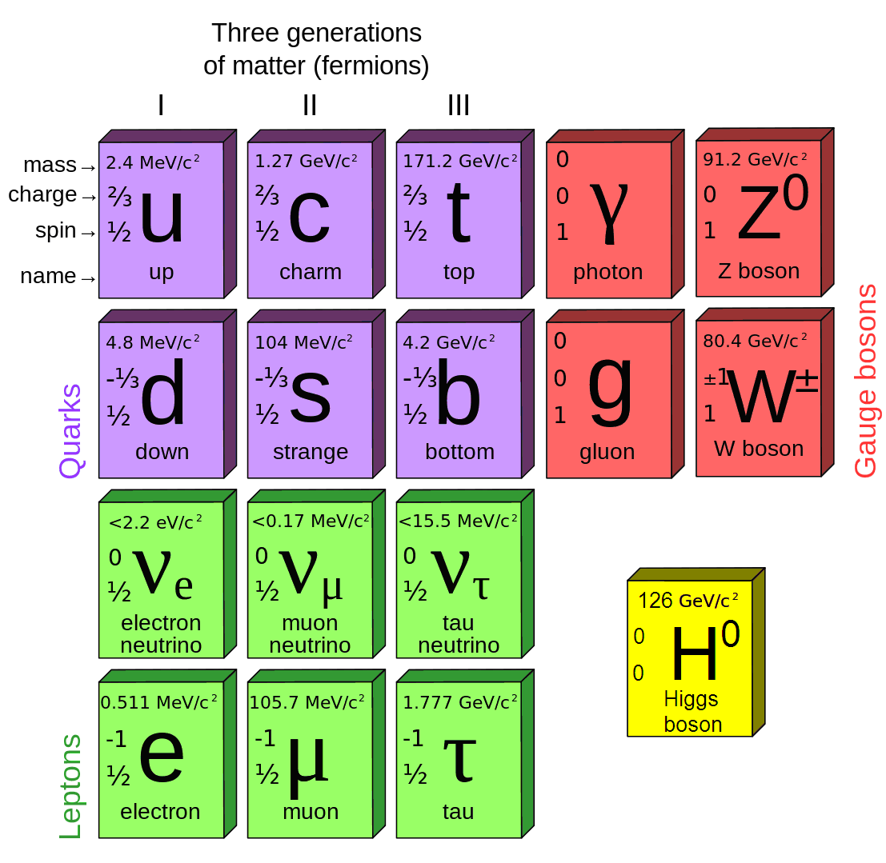
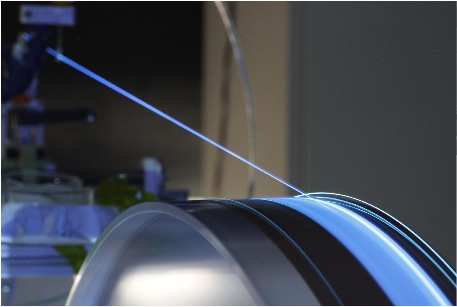

## Research

  <i>Why is our Universe made of matter and not of antimatter?</i>

This simple question implies that the laws of physics have a preference for matter. 
However, the asymmetry that we observe
in our labs today is much too small to explain the matter-antimatter imbalance that we see in the Universe.
This is one of the <a href="https://en.wikipedia.org/wiki/List_of_unsolved_problems_in_physics">unsolved questions in physics</a> and it was the 
main topic of my research.
I have carried out precision measurements of the smallest differences 
between <a href="http://lhcb-public.web.cern.ch/lhcb-public/en/Physics/Antimatter-en.html">matter and anti-matter</a>.
If these measurements show small deviations from their 
predictions, this could be a sign of new, yet unknown particles
that influence these measurements. In this approach, we hope to find out more about the physics that governs our Universe.
This research was awarded a
<a href="http://www.nwo.nl/en/funding/our-funding-instruments/nwo/innovational-research-incentives-scheme/vidi/index.html">Vidi</a> research grant in 2013. 
It was carried out between 2013 and 2018 at <a href="https://www.nikhef.nl">Nikhef</a> using the <a href="http://lhcb-public.web.cern.ch/lhcb-public/">LHCb</a> detector at the 
<a href="http://lhc.web.cern.ch/lhc/">Large Hadron Collider </a> at <a href="http://public.web.cern.ch/public/">CERN</a>.

### Reaching the highest precision

The smallest particles and how they interact is described by a single model, the Standard Model. This model contains quarks, leptons, force carriers and the Higgs particle. In my research I have investigated the properties of two heavy quarks, namely the <i>c</i>- and <i>b</i>-quark.
At the LHCb detector we see many millions of particles which contain a <i>b</i>-quark. These so-called <i>B</i> particles decay within one centimeter to other particles that we record in our detector. By measuring whether the <i>B</i> particle or anti-<i>B</i> particle decay at the same or different rates, we can determine this matter-antimatter asymmetry. Very often these particles decay into a particle containing a <i>c</i>-quark and two leptons (a charged lepton and a neutrino). This type of decay is called a semileptonic <i>B</i> decay, and was at the heart of my research. Since we had millions of these decays available we have measured the matter-antimatter asymmetry with the highest possible precision (at the permille level).

### Research programme

The neutral particles <i>B</i>0, <i>B</i>s and <i>D</i>0 
(and also <i>K</i>0) have the special property that they can transform into 
their own antiparticle, and back. This quantum-mechanical phenomenon is called mixing. 
And what we have found out is that the probability that such a particle oscillates 
into its antiparticle is the same as the probability of the reverse process. This is 
the topic that I have studied together with my two PhD students. Another test that I 
have carried out, together with two master students, is whether <i>B</i> 
and anti-<i>B</i> have the same mass. Following Einstein's relativity, 
they should have the same mass and it should be independent of the velocity of the 
particle (Lorentz invariant). If not then Einstein was wrong, and it would have opened up a 
whole research field. Finally, with these semileptonic <i>B</i> decays my group has tested if the 
couplings to the different lepton families are the same (lepton universality). If they 
are different this could be coming from a charged Higgs particle (which is not 
described in the Standard Model). To summarise, this research has measured
        <ul>
                <li>Asymmetry in <i>B</i>0 mixing,</li>
                <li>Asymmetry in <i>B</i>s mixing,</li>
                <li>Asymmetry in <i>D</i>0 decays,</li>
                <li>Lorentz-invariance in <i>B</i>0 and <i>B</i>s mixing,</li>
                <li>Lepton universality in semileptonic <i>B</i> decays.</li>
          </ul>

### Upgrading the LHCb detector

The LHCb detector is being upgraded between 2019 and 2021. By upgrading the LHCb detector we can improve the precision 
of the measurements by a large factor. This means that we
have to redesign crucial parts of the LHCb detector, in particular the trigger and the tracking system. I have worked
on redesigning the main tracking system. This system will consist of scintillating fibres, and therefore it is called
the SciFi detector. I have worked on simulations of this detector and, with the technical department at Nikhef, on the design of the 
readout box.

